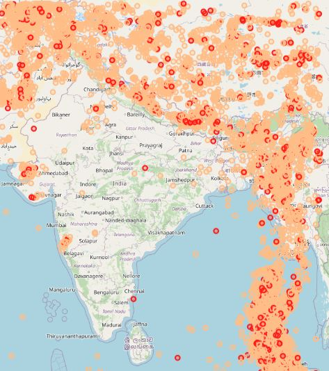
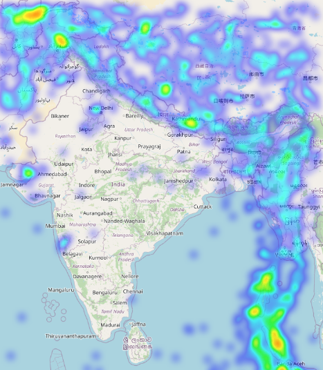

# Geo-visualization of Earthquakes in Indian Subcontinent 

Earthquakes occur along fault lines, cracks in Earth's crust where tectonic plates meet. Scientists describe the intensity of an earthquake using the Richter Scale. It measures earthquakes on a scale of 1 to 10. People barely feel a magnitude 3 earthquake . A magnitude 6 or above earthquake is considered a major one can cause major Damage. 

Based on the past seismic history, Bureau of Indian Standards grouped the country into four seismic zones namely Zone-II, Zone-III, Zone-IV and Zone-V. Of all these four zones, Zone-V is the most seismic active region whereas Zone-II is the least.

Using the data base provided, a scattered plot has been plotted.

scattered plot is usefull in plotting all the events and classifying different them according to their magnitude etc
For better analysis, I am using heat map Heatmap and comparing the output to the zones defined by the  Bureau of Indian Standards.

